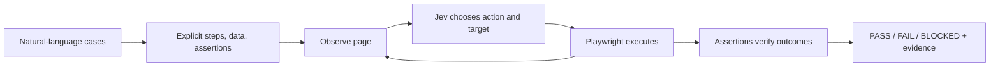

I think `jev-e2e` is a good use case for Jev as the UI decision component of a test runner. The promising product is natural-language test authoring, discovery of unfamiliar flows, and fast repeat execution with explicit evidence. Reliable results require assertions that remain separate from the navigation model.

Research snapshot: September 18, 2026, before the alpha implementation. This review covers five public repositories and TypeSafe documentation. Performance numbers below were reported by the repository authors and were not independently reproduced. Measured jev-e2e results are in [TEST_RESULTS.md](TEST_RESULTS.md); this document provides background for the design.

**What Jev provides.** Jev accepts application state and typed questions. `Choice` selects from supplied alternatives, `Noul` estimates whether a proposition is true, and `Score` evaluates an ordered rubric. Independent questions can share a request. For UI automation, code can expose observed controls and supported operations, then ask Jev to choose an operation and compatible target. A Choice supports up to 255 alternatives. Sources: [primitives](https://docs.typesafe.ai/primitives), [Choice](https://docs.typesafe.ai/primitives/choice), [fan-out](https://docs.typesafe.ai/patterns/fan-out).

Current official documentation lists `jev-1.13.0`, $0.042 per million input tokens, free output tokens, and text-only input. It documents a 64k total request budget and 32k for state plus the longest question. Jev does not adapt its weights to individual customers; application memory belongs in your runner. Pin a model version for reproducible tests. An open-source runner using Jev still makes paid provider calls. Source: [models](https://docs.typesafe.ai/models).

The documented weaknesses include literal interpretation, numeric and date comparisons, multiple reasoning hops, distracting state, and adversarial text. Jev does not generate ordinary text. These weaknesses directly affect tests involving exact totals, dates, counts, complex business workflows, and page content that attempts to steer the agent. Source: [Jev 1.13 limitations](https://docs.typesafe.ai/model-jaggedness/jev-1.13).

Choice/Score confidence summarizes the concentration of the returned distribution. Noul has no separate confidence field. These values can help the runner escalate or abstain; they are not an independently measured probability that a browser task succeeded. Source: [confidence](https://docs.typesafe.ai/confidence).

| Part of jev-e2e | Fit for Jev | What the runner should do |
| --- | --- | --- |
| Select the relevant observed button or field | Strong candidate | Supply labels, values, roles, state, and nearby context; validate the target before acting |
| Choose click, fill, select, scroll, wait, or stop | Strong candidate | Offer only operations the current page supports |
| Recognize a page or categorize a visible error | Useful candidate | Keep questions narrow and preserve supporting evidence |
| Check a semantic expectation such as an error conveying invalid credentials | Useful with evaluation | Evaluate the relevant visible text and report uncertainty |
| Turn arbitrary prose into a multi-step test specification | Incomplete by itself | Use a generative model, or accept an explicit structured case |
| Produce arbitrary field values, selectors, code, or written explanations | Poor fit | Use provided fixtures, deterministic code, or a generative model |
| Assert exact amounts, dates, counts, URLs, and persistence | Use ordinary code | Read the values and compare them exactly |
| Check colors, canvas content, layout, and icon-only controls | Requires another observation method | Use a visual model or application instrumentation where needed |
| Learn a website across runs | Application responsibility | Store verified steps, locator descriptions, assertions, and useful observations |

**The browser repositories.** The names are easy to confuse. `wy-coliney/jev-browser-use`, `browser-use/jev-ultrafast`, and `jkudish/jev-browser` are different implementations with different runtime requirements.

| Repository inspected | Runtime | Jev's role | Relevance to jev-e2e |
| --- | --- | --- | --- |
| [browser-use/jev-ultrafast](https://github.com/browser-use/jev-ultrafast) | Python + Browser Harness/CDP | Operation and operation-specific target choices in one request | Best concise reference for a fast guarded action loop |
| [wy-coliney/jev-browser-use](https://github.com/wy-coliney/jev-browser-use) | JavaScript helper inside Codex Computer Use | Select the next permitted mechanical action | Useful host/worker split; currently depends on the host runtime |
| [jkudish/jev-browser](https://github.com/jkudish/jev-browser) | TypeScript + Playwright, library/CLI/MCP | Action selection plus goal/stuck judgments | Closest packaging and browser infrastructure reference for a standalone web runner |

**`browser-use/jev-ultrafast` exposes what the browser can actually do.** Its snapshot reader constructs an indexed control table with labels, values, roles, and selection states. `model.choose()` asks for the operation and the compatible target for each possible operation together. Code consumes only the target head matching the selected operation. Jev does not generate selectors or executable actions. Source: [model.py at the inspected commit](https://github.com/browser-use/jev-ultrafast/blob/1231850a0bf1a0c0341fe408ef1668dbbfdfac46/jev_ultrafast/model.py).

`Agent` repeats prediction, execution, and observation. A selected text field triggers a separate small generative model. Decisions are consumed before mutation, and actions are logged before reading their results. Stale observations can be refreshed without automatically repeating a browser mutation. Source: [agent.py](https://github.com/browser-use/jev-ultrafast/blob/1231850a0bf1a0c0341fe408ef1668dbbfdfac46/jev_ultrafast/agent.py).

The browser executor validates observed node identity, current page/form state, target context, current geometry, and whether another element covers the target. This matters when an asynchronous render changes the page while a model request is in flight. Sources: [browser.py](https://github.com/browser-use/jev-ultrafast/blob/1231850a0bf1a0c0341fe408ef1668dbbfdfac46/jev_ultrafast/browser.py), [snapshot.js](https://github.com/browser-use/jev-ultrafast/blob/1231850a0bf1a0c0341fe408ef1668dbbfdfac46/jev_ultrafast/snapshot.js).

The Flights example supplies an independent verifier for route, date, ticket type, and visible results. Its `DONE` status alone does not pass that example. This is the most useful testing lesson in the repo. Source: [examples/flights.py](https://github.com/browser-use/jev-ultrafast/blob/1231850a0bf1a0c0341fe408ef1668dbbfdfac46/examples/flights.py).

The authors report a 7.073-second Flights run, with median Jev latency of 178 ms, and three successful runs per arm in a runtime comparison. The clock excludes browser setup, initial navigation, and fresh post-run verification. Their optimized median was 7.092 seconds versus 9.450 seconds for the earlier runtime using the same models. This supports a narrow speed claim, not general E2E reliability. Source: [performance report](https://github.com/browser-use/jev-ultrafast/blob/1231850a0bf1a0c0341fe408ef1668dbbfdfac46/docs/performance.md).

Its documented scope excludes shadow roots, frames, canvas, uploads, popup tabs, nested scrolling, and arbitrary keyboard widgets. Owned tabs share the existing Chrome profile. A CI testing product would need deliberate browser isolation and support for its chosen widget set. Source: [README](https://github.com/browser-use/jev-ultrafast/blob/1231850a0bf1a0c0341fe408ef1668dbbfdfac46/README.md).

**`wy-coliney/jev-browser-use` divides work between the host and Jev.** The host handles planning, text input, visual interpretation, and verification. Jev handles allowed clicks, toggles, scrolling, reload, and bounded keyboard actions. It uses the existing Codex Computer Use connection rather than installing its own browser driver. Its reported 5–10x improvement concerns browser operations in the authors' workflows, with server processing excluded. Source: [README](https://github.com/wy-coliney/jev-browser-use/blob/f2795fc278859ad0ff20b77626236050f82e9a22/README.md).

`bridge.mjs` parses accessibility text, resolves explicitly named controls or discovers unique permitted controls, and submits a Choice containing those actions plus `DONE`, `BLOCKED`, and `WAIT`. It validates returned choices, rechecks fresh state and allowed origins before acting, retains history across handoffs, and stops on budgets or unsuccessful progress. A completion decision returns `needs_verification`. Source: [bridge.mjs](https://github.com/wy-coliney/jev-browser-use/blob/f2795fc278859ad0ff20b77626236050f82e9a22/skills/jev-browser-use/bridge.mjs).

This is useful as a design reference for escalation and bounded execution. It is less suitable as jev-e2e's standalone runtime because it depends on a compatible Codex tab API and module-import environment. Its helper does not implement typing, native selects, frames, canvas, uploads, or native desktop execution; the host covers those gaps. Source: [repository skill documentation, inspected as reference](https://github.com/wy-coliney/jev-browser-use/blob/f2795fc278859ad0ff20b77626236050f82e9a22/skills/jev-browser-use/SKILL.md).

**`jkudish/jev-browser` packages an autonomous Playwright agent.** It exposes a library, CLI, and MCP server. The runner launches Chromium with a fresh browser context and produces a final page payload, screenshot, action history, and console/network diagnostics. Source: [README](https://github.com/jkudish/jev-browser/blob/257edfc19dfe5194c153ba94f351425630a46aeb/README.md).

Each primary Jev call contains an action Choice and separate goal/stuck Nouls. A native select can require another Choice for its option. These questions are evaluated independently against the same supplied state, but they are not independent ground-truth verifiers. Source: [questions.ts](https://github.com/jkudish/jev-browser/blob/257edfc19dfe5194c153ba94f351425630a46aeb/src/questions.ts).

The code extracts DOM controls, stamps them with generated identifiers, and caps the offered elements at 240. It filters noisy labels and destinations and maps selected actions back to code-owned selectors. Its generic noise list includes `log in` and numeric-only labels; those filters would be inappropriate for many login and date-picker tests. Source: [lib.ts](https://github.com/jkudish/jev-browser/blob/257edfc19dfe5194c153ba94f351425630a46aeb/src/lib.ts).

The runner stops when the action says done or a goal threshold fires. It detects repeated no-effect actions and can choose an alternative. Text comes from a generative provider, with a keyword heuristic fallback; the typing path fills the field and then presses Enter. For a test runner, exact fixture values, deliberate submission steps, and explicit assertions should replace these generic assumptions. Source: [navigate.ts](https://github.com/jkudish/jev-browser/blob/257edfc19dfe5194c153ba94f351425630a46aeb/src/navigate.ts).

Use this repo to understand standalone packaging, Playwright lifecycle, time limits, cancellation, and diagnostics. Its navigation completion signals need a separate assertion layer before becoming test results. The important opportunity is the testing contract and evidence, not wrapping its status in a green badge.

**The desktop repositories need careful attribution.** GitHub and web searches did not identify a public repository named exactly `jev-desktop`. I inspected two relevant desktop projects instead; this does not establish which repo you originally had in mind.

`awlevin/typesafe-computer-use` is an actual Jev integration for macOS. It combines Apple Vision OCR with accessibility controls and focused-field state, then sends Jev Choices for action kind, clicked item, website, and optionally an offscreen control. Deterministic date hints provide information Jev would otherwise struggle to compare. Source: [decide.py](https://github.com/awlevin/typesafe-computer-use/blob/ccde756a3145cd177e6a7396ddbab48286afaf75/typesafe_computer_use/decide.py).

A small writer supplies free text or proposed URLs when needed. The action code can use accessibility operations with mouse/keyboard fallbacks; it reads back field values and also uses a Noul to evaluate typed content. Source: [actions.py](https://github.com/awlevin/typesafe-computer-use/blob/ccde756a3145cd177e6a7396ddbab48286afaf75/typesafe_computer_use/actions.py).

Its run artifacts preserve screenshots, exact model payloads, decisions, history, and phase timings, making failed steps replayable. It stops on model completion, low confidence, no progress, or limits. It does not provide a general independent test-case assertion engine. Source: [runner.py](https://github.com/awlevin/typesafe-computer-use/blob/ccde756a3145cd177e6a7396ddbab48286afaf75/typesafe_computer_use/runner.py).

The authors report roughly 1.5 seconds per step including capture/OCR in their comparison. OCR, accessibility coverage, foreground focus, and machine-specific permissions are material limitations. Do not use the model-only latency to estimate desktop suite duration. Source: [README](https://github.com/awlevin/typesafe-computer-use/blob/ccde756a3145cd177e6a7396ddbab48286afaf75/README.md).

`max1874/jev-computer-use` ports the indexed-action idea to macOS accessibility using a long-lived Swift bridge. Its current decision implementation calls an OpenAI-compatible chat endpoint and requests structured generative output, including text values and a risk assessment. Despite the name, the inspected code is not a TypeSafe Jev client. It also has a screenshot fallback using a vision-capable model. Source: [model.py](https://github.com/max1874/jev-computer-use/blob/666e0ebf2232960212cf51d39eb20c978a4c8a64/jev_computer_use/model.py).

Its useful ideas include guarded accessibility identities, stopping after uncertain mutation outcomes, and a caller-supplied verifier. It records dispatch, window changes, and verified outcomes separately. Source: [agent.py](https://github.com/max1874/jev-computer-use/blob/666e0ebf2232960212cf51d39eb20c978a4c8a64/jev_computer_use/agent.py).

The README explicitly describes adding Jev as a next step. Its reported calculator success and decision latency use DeepSeek, so they are not Jev benchmarks. This distinction matters when choosing a dependency on the strength of a demo. Source: [README](https://github.com/max1874/jev-computer-use/blob/666e0ebf2232960212cf51d39eb20c978a4c8a64/README.md).

**Recommended first version.** Build a standalone web CLI around Playwright. Study jev-ultrafast's indexed choices and execution guards, jev-browser's browser lifecycle and diagnostics, and jev-browser-use's handoffs. Reuse existing libraries where practical. A new browser driver or a desktop abstraction is not necessary for the first web version.

1. Accept a URL, natural-language cases, and optional fixture/auth configuration.
2. Convert each case into explicit steps, exact data, and expected assertions. A generative model can propose this specification. Report missing or contradictory requirements before running the case.
3. Observe the current page and expose supported operations and actual targets. Use Jev for narrow action/target decisions; execute validated actions through Playwright.
4. Verify each required outcome using fresh observations. Prefer exact assertions; use evaluated semantic judgments where an exact comparison would miss the intent.
5. Save the verified flow, locator descriptions, model version, and assertions for repeat execution.
6. Produce a per-case result with screenshots/trace, failed expectation, actual evidence, action history, and elapsed time.

For simple cases with supplied data, no text generation is required during execution: Jev selects the field and code enters the exact fixture value. Keep an optional generative fallback for genuinely open-ended tasks. The user's test intent stays fixed regardless of the fallback used.

**Learning should create runner memory.** Save the successful sequence and its assertions, then replay verified actions when targets still resolve correctly. Use Jev to resolve semantic targets or handle allowed branches when needed. This can avoid rediscovering the site on every CI run. Preserve locator meaning with role, label, context, and state; a transient index from an earlier snapshot is not reusable memory. No broad site graph is needed until actual flows show that storing a sequence is insufficient.

Exploration does not establish correctness by itself. An observed baseline can contain a bug. Expected behavior should come from the user's case or an explicit product contract, not from whichever outcome the exploration run produced.

**Pass/fail should have a third state.** PASS means every required assertion was checked and satisfied. FAIL means observed behavior violated a required expectation. BLOCKED means the runner could not complete or verify the case, for example because an authenticated fixture was unavailable or a required control was unsupported. All unverified outcomes must remain non-passing in CI. Keep the runner's completion signal separate from the test verdict.

Example cases:

| User case | Execution | Evidence required |
| --- | --- | --- |
| Create a project named `Demo` and confirm it survives reload | Navigate, enter exact name, save, reload | Exact project identity still exists after reload; API confirmation if configured |
| Sign in using the invalid-password fixture | Enter the exact supplied credentials and submit | Relevant error is shown and the session remains unauthenticated |
| Apply a 10% discount to a $100 item | Navigate and apply specified code | Computed expected price is exactly $90; tax/shipping expectations must be specified separately |

Do not repair an invalid-password test by substituting working credentials. Do not replace a failed save with an alternative creation path unless the test allows it. Locator repair can preserve a case; changing data, expected outcomes, or mandatory steps changes the case. Repeated attempts should retain the initial failure and any flakiness rather than erase it after a lucky pass.

Playwright already supports isolated contexts, meaningful locators, awaited assertions, and trace-based debugging. Use those capabilities as the test foundation. Source: [Playwright best practices](https://playwright.dev/docs/best-practices).

**The business opportunity needs evidence.** Natural-language UI testing already exists: Midscene provides natural-language actions and assertions, reports, and web/mobile/desktop integrations. A natural-language input box alone is insufficient differentiation. Source: [Midscene](https://github.com/web-infra-dev/midscene).

My proposed wedge is quick onboarding for teams with little E2E coverage, plus cheap repeat runs that keep the original requirements intact and explain failures with evidence. An open-source CLI could support adoption; hosted preview-deployment checks, parallel execution, retained reports, and team history could support a paid service. These are product hypotheses, not validated customer demand.

Before claiming speed or reliability, evaluate 20–30 representative flows with both working and intentionally broken app versions. Compare discovery and repeat runs against a conventional Playwright baseline and a general-model navigation baseline. Measure false passes first, then detection coverage, runner failures, repeatability, end-to-end time, provider cost, and fallback frequency. Include renamed labels, missing controls, wrong totals, failed persistence, stale success messages, and denied permissions. A fast runner that accepts deliberately broken flows has not solved testing.

The most defensible initial promise is: **describe a flow once, rerun it quickly, and see evidence for every result.** Jev is a promising component for that promise; it is not the complete testing system.

Inspected repository commits:

| Repository | SHA |
| --- | --- |
| browser-use/jev-ultrafast | `1231850a0bf1a0c0341fe408ef1668dbbfdfac46` |
| wy-coliney/jev-browser-use | `f2795fc278859ad0ff20b77626236050f82e9a22` |
| jkudish/jev-browser | `257edfc19dfe5194c153ba94f351425630a46aeb` |
| awlevin/typesafe-computer-use | `ccde756a3145cd177e6a7396ddbab48286afaf75` |
| max1874/jev-computer-use | `666e0ebf2232960212cf51d39eb20c978a4c8a64` |
