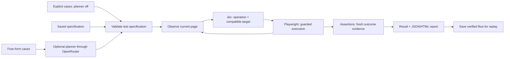

The vision is an open-source natural-language test runner that people can install and run against their own web apps, followed by a hosted product that manages execution and infrastructure. The first release should establish whether users can describe useful cases, get trustworthy results quickly, and keep using the runner. The cloud product should grow from that evidence.

This original design plan now has an alpha implementation, updated September 18, 2026. See [README.md](README.md) for runnable commands and [TEST_RESULTS.md](TEST_RESULTS.md) for actual checks. Proposed interfaces below describe the design history; the implemented transports live in `src/providers.ts` and the static UI in `public/`. Raw traces and direct TypeSafe transport remain future work.

**The initial product would be a local web UI, a CLI, and a reusable TypeScript runner.** Target Chromium web applications with common forms, buttons, links, checkboxes, and native selects. Users provide a URL and cases in the UI or a Markdown file. A general generative model is an optional interpreter for free-form cases; OpenAI is an optional model vendor. Prefer the existing OpenRouter credential for planning and, if its decision protocol passes verification, Jev. A separate OpenAI API key is not required. Users can watch execution in a headed browser or run headless. Each case produces PASS, FAIL, or BLOCKED with its expectations and evidence. Native desktop/mobile execution, visual layout judgments, and cloud execution are outside this release's advertised scope.

The first audience is developers who want to check a small set of important flows on their own app without maintaining handwritten selectors. The initial promise is: describe the case, discover its flow during execution, and return evidence for each expected outcome. Validate authoring, meaningful bug detection, and repeat usage before investing in hosted infrastructure.

The proposed interface, once the package is available, is:

```sh
npx jev-e2e run --url http://localhost:3000 --cases tests.md --headed
npx jev-e2e run --url http://localhost:3000 --cases explicit-tests.md --planner off
npx jev-e2e ui
```

An example input file:

```markdown
1. Sign in using the invalid-password fixture. Expect a credentials error
   and an unauthenticated session.
2. Using the signed-in fixture, create a project called Demo. Reload the page.
   Expect exactly one project called Demo to remain.
3. Filter projects to Archived. Expect exactly the two archived projects
   from the seeded fixture, each with status Archived.
```

Test credentials belong in local environment variables or a local fixture configuration. The cases reference fixtures by name. The runner enters their exact values without asking a model to invent replacements. Authenticated cases can use a supplied Playwright storage-state file. Every case has a fresh browser context; browser isolation does not reset the application's database. The test fixture must define initial app state and cleanup where mutations require them. Source for browser authentication storage: [Playwright BrowserContext](https://playwright.dev/docs/api/class-browsercontext#browser-context-storage-state).

**The first architecture would have four stages.** An optional generative interpreter or a supported explicit case format produces the same validated test specification. Jev chooses UI actions and observed targets during execution. Playwright performs those actions and collects observations. Assertions determine results and a local report explains them.



The planner specifies semantic milestones, such as reaching the project-creation form, entering a supplied name, saving, and verifying persistence. It must not guess page-specific selectors, generate executable browser code, or claim it already knows an unfamiliar site's navigation. The first execution discovers the needed UI while performing the actual case; there is no need to execute a side-effectful flow once for learning and again for testing.

**Make the general model optional.** Jev can understand a natural-language goal and select observed controls without GPT. Its limitation is open-ended generation, not natural-language comprehension. Do not use a general model merely to type an exact supplied value or compute counts, totals, or dates. Source: [Jev 1.13 limitations](https://docs.typesafe.ai/model-jaggedness/jev-1.13#generation).

| Entry mode | Interpretation | Execution | Boundary |
| --- | --- | --- | --- |
| Free-form cases, planner on | A configured generative model converts prose into milestones, input bindings, and supported expectations | Jev + Playwright | Missing data or ambiguous correctness criteria must be surfaced |
| Explicit cases, planner off | Code parses documented `Goal`, `Input`, fixture, and `Expect` templates | Jev + Playwright | Supports a small stated grammar; arbitrary prose is not silently guessed |
| Saved specification or verified flow | Validate the existing specification; no new interpretation call | Replay guarded actions; use Jev for allowed target resolution when needed | Recheck all original assertions on fresh state |

Proposed planner-off input, to be implemented and documented as a supported template:

```text
Case: Project creation persists
Goal: Create a project named "Acme".
Input: project name = "Acme"
Expect: project named "Acme" exists exactly once after reload.
```

The goal remains natural language; explicit fields supply the values and a checkable expectation. Code converts supported expectations into assertion types. Jev selects the controls needed to achieve the goal, while the runner enforces the required reload and exact count. An unsupported expectation is BLOCKED before browser mutations. Do not build a universal natural-language parser for planner-off mode.

**Use OpenRouter HTTP calls for optional interpretation.** The Node process reads `OPENROUTER_API_KEY` and uses built-in `fetch` against `POST https://openrouter.ai/api/v1/chat/completions`. Request `response_format: json_schema` using the shared specification schema. Select a model/provider endpoint that supports the requested parameters, and require parameter support during routing. Runtime validation remains necessary: schema enforcement varies by endpoint and a schema-valid plan can still misread intent. Handle refusals, incomplete responses, missing output, and invalid semantics before execution. Preserve supplied values, fixture references, negative intent, and every required expectation. Sources: [OpenRouter API quickstart](https://openrouter.ai/docs/quickstart), [structured outputs](https://openrouter.ai/docs/guides/features/structured-outputs).

OpenRouter serves OpenAI models through its own credential, so direct `OPENAI_API_KEY` and a direct OpenAI SDK integration are not MVP requirements. Select and pin a schema-capable planner model through evaluation; store its ID as `OPENROUTER_PLANNER_MODEL`. OpenAI is a possible choice, and another compatible model can be evaluated against the same contract. Switching models requires re-evaluation rather than a silent fallback. Source: [OpenRouter OpenAI catalog](https://openrouter.ai/openai).

Plan once per new or edited free-form case, show the interpreted steps and expectations in the UI, and reuse the saved specification on later runs. Intent or fixture-definition edits mark a cached specification stale, and its schema must remain compatible; runtime fixture state must still be validated on each run. Record planner/model versions as provenance. Explicitly requesting interpretation with a new model/version creates a new plan; an existing compatible saved plan can run without any planner configuration. Planner-off cases are re-parsed locally. Planned configuration uses `JEV_E2E_PLANNER=on|off`, with an explicit CLI override. Free-form interpretation is enabled by default; absent planner configuration blocks that mode with instructions to configure it or use the explicit format. It must not silently fall back to guessing. Saved specification replay requires no generative planning call.

**The test specification is the contract.** Each case contains its name, original intent, preconditions/fixture references, required milestones, exact input values or references, expected assertions, and execution limits. Validate it at runtime before browser mutations. Missing required data, contradictory expectations, and unsupported assertions must be reported as incomplete or blocked rather than silently guessed.

Start with assertions for visibility, text, URL, field/selection state, exact counts, and parsed numeric values. Verify persistence by reloading and re-reading the relevant identity. Bind checks to the intended entity and context so another matching toast or record cannot substitute for the expected outcome. Counts and numeric/date comparisons run in code. Semantic judgments about open-ended text and visual-only requirements need later, separately evaluated capabilities; neither is part of the first release's advertised assertion set.

PASS requires every required milestone and assertion to be checked and satisfied. FAIL means observed behavior violates an expectation. BLOCKED means execution or verification could not be completed. Only an entirely passing required suite exits successfully in CI. A model's DONE signal merely triggers verification. A timeout, provider outage, or unsupported widget cannot become a pass.

**Use OpenRouter's Decisions API for Jev.** Minimal authenticated requests now pass through `POST https://openrouter.ai/api/alpha/decisions`, including two independent Choice questions for a target and an explicit no-match answer. A schema-constrained GPT request also passed with the same key. One-key access and focused error, deadline, cancellation, and real-browser checks now pass; see TEST_RESULTS.md for repeated evaluation status. Listing support alone was insufficient: Jev uses the Decisions route, with `state` and named `questions`, rather than a conventional text-generation payload. Sources: [Decisions API](https://openrouter.ai/docs/api/api-reference/alphadecisions/submit-a-decisions-questions-and-answers-request.md), [live results](LIVE_PROVIDER_CHECK.md). Setup status: [OPENROUTER_SETUP.md](OPENROUTER_SETUP.md).

Use built-in `fetch` for this verified protocol. Each Choice supplies `type`, `instructions`, and a `criteria` map; validate `answers[name].type` and `answers[name].choice` against the offered candidates before action. Record the resolved model: the smoke check returned `typesafe/jev-1.13-20260917`. The route is alpha, so retain focused compatibility checks. No direct TypeSafe credential is needed for the verified OpenRouter route.

The initial integration milestone must establish the supported endpoint/schema and verify a small Choice request, valid/no-match answers, response mapping, resolved model, usage, provider errors, cancellation, and a bounded deadline. Multiple independent Choice questions are an optimization to verify before enabling. Noul and Score are not required for the first assertion set. Implement only the verified protocol in an ordinary `decide()` function; do not create a general model-provider framework.

If OpenRouter cannot carry the required protocol, use the official `@typesafe-ai/sdk` and `TypeSafeClient.systemOne()` with a direct `TYPESAFE_API_KEY`. Its underlying endpoint is `POST https://api.typesafe.ai/v1/systemone`. A direct TypeSafe credential would then be needed for live Jev tests; an OpenRouter key cannot substitute for it. Neither route installs Jev locally. Sources: [JavaScript SDK](https://docs.typesafe.ai/sdk/javascript), [HTTP API](https://docs.typesafe.ai/api).

An illustrative direct-TypeSafe fallback call for one observed page:

```ts
import { choice, TypeSafeClient } from '@typesafe-ai/sdk';

const jev = new TypeSafeClient({ defaultModel: 'jev-1.13.0' });

const result = await jev.systemOne({
  state: {
    step: 'Open account settings',
    controls: [
      { id: 'e1', role: 'button', label: 'Account settings' },
      { id: 'e2', role: 'button', label: 'Help' },
    ],
  },
  questions: {
    target: choice('Which observed control opens account settings?', {
      e1: 'The observed Account settings button',
      e2: 'The observed Help button',
      none: 'No supplied control matches the step',
    }),
  },
});
```

This shows the proposed SDK usage; it is not an implemented browser integration. The actual executor maps a validated result back to the observed control and checks freshness before acting.

The execution loop will batch independent operation and compatible-target questions into one request when useful. Each target question assumes its own operation; questions cannot inspect one another's answers. Code consumes only the head matching the chosen operation. Include an explicit no-match/blocked route, and keep candidate sets within documented limits. Source: [fan-out](https://docs.typesafe.ai/patterns/fan-out).

The snapshot includes the current milestone, relevant visible text, control identities, roles, labels, current non-secret values/states, and recent outcomes. Credentials and authentication tokens remain outside model state and public artifacts. Capture observation and action identity carefully; before input, resolve the current target and reject replaced, disabled, or covered controls.

Treat page content as observations, not permission to rewrite a case or its expectations. Restrict automated navigation and fixture-secret entry to the configured app origins; a request to leave those origins blocks unless the suite explicitly allows the destination. Keep origin checks in the executor so model output cannot bypass them.

Pin the Jev model for each tested release, record the resolved model and usage, and retain decision latency and fallback counts. Budget requests and browser actions under one per-case deadline, with explicit request/action caps and an evaluation spending cap. HTTP calls receive the run's abort signal. If using the TypeSafe SDK, its timeout is per attempt, so enforce the total deadline in the runner. Retry model reads within that budget; stop after an unknown mutation outcome instead of automatically submitting again. Keep the current key's usage cap unless the user explicitly changes it. Sources: [client configuration](https://docs.typesafe.ai/sdk/javascript/api/interfaces/TypeSafeClientConfig), [request cancellation](https://docs.typesafe.ai/sdk/javascript/api/interfaces/RequestOptions), [model versions](https://docs.typesafe.ai/models).

**Create one npm package with a small core.** Use Node.js 22+, TypeScript, Playwright's browser/assertion APIs, and Zod for runtime specification validation and JSON Schema generation. Use Node's HTTP server, filesystem, argument parsing, and `fetch`; add the official Jev SDK only if the selected transport needs it. Playwright supplies awaited actions/assertions, meaningful locators, fresh browser contexts, and private diagnostic traces. A custom CDP driver would make us rebuild those capabilities before validating demand; reconsider a narrow CDP optimization only after profiling. Source: [Playwright best practices](https://playwright.dev/docs/best-practices). Keep the CLI and local server as callers of an ordinary `runSuite()` function. Proposed source responsibilities:

| File | Responsibility |
| --- | --- |
| `cli.ts` | Arguments, configuration, case files, exit status |
| `server.ts` | Serve the local UI, start/cancel a suite, stream progress |
| `public/` | Native HTML controls, CSS theme, and a small JavaScript UI |
| `plan.ts` | Optional interpretation, explicit-format parsing, cached plans, and validation |
| `browser.ts` | Browser contexts, bounded observations, target identities, action execution |
| `providers.ts` | Verified Jev and optional planner transports, typed decisions, cancellation, usage metadata |
| `runner.ts` | Case lifecycle, milestones, limits, progress, teardown |
| `assertions.ts` | Supported outcome checks using fresh evidence |
| `report.ts` | Per-case JSON and static HTML evidence |
| `types.ts` | Shared case/result schemas |

These are concrete functions and contracts, not a general provider or browser-plugin framework. Read the relevant existing implementations before borrowing code, and retain required source notices. The proposed license is MIT. Public release material should include a quickstart, a small local demo app, passing and deliberately failing examples, documented model/data flow, contribution instructions, an issue template, and a GitHub Actions example. Browser installation should be an explicit setup command.

**The local UI shares the runner.** Serve static HTML/CSS and compiled UI TypeScript from one Node process using its standard HTTP server. Start with one active suite, run cases sequentially, stream progress with server-sent events, and expose cancellation. A second start while busy returns a clear busy response. The server binds to loopback and validates request origin and a session token for mutation routes. The UI receives only credential availability, not API key values. Keys stay in process environment or a git-ignored local `.env`; no browser storage or client bundle contains them. Do not render page/model text as executable HTML.

Use local files for saved suites, compiled plans, and results. No database, hosted queue, account system, or billing service is needed for this version. Case events and reports are ordinary data emitted by the runner so the UI and CLI show the same verdicts. Closing or reconnecting the UI does not start another suite or change its result.

**Use Firecrawl as the visual reference.** The inspected homepage uses a near-white background, orange accents, dark spacious type, fine grid lines, and small monospace details. Apply that direction to case input, execution progress, and evidence using original jev-e2e branding. The proposed palette and screen states are in [UI_DESIGN.md](UI_DESIGN.md). Reference: [Firecrawl](https://www.firecrawl.dev/).

For shared artifacts, redact credential bindings and API keys in action summaries, model state, errors, and screenshots. Treat raw traces and network logs as private diagnostic files: they may contain application data and should be opt-in rather than an automatically shareable report. Tests must check these distinctions with fake secret values.

**Replay should reuse verified work.** Save the compiled specification and successful action descriptions with locator meaning and context. On repeat execution, replay when targets still resolve and validate. Use Jev when semantic target resolution or an allowed branch needs a decision. Do not reuse transient DOM indices across pages or runs. Treat any repaired locator as a new resolution requiring validation, and always rerun the original assertions.

The runner may adapt how it finds a required control. It must not change fixture values, required milestones, or expected outcomes to get a pass. Negative cases are particularly important: an invalid-password case must remain an invalid-password case. Retain the first failure when a repeat attempt passes, so reports expose flakiness rather than erase it.

**Test the runner separately from the models' intelligence.** Offline tests establish that the software behaves correctly given supplied model outputs. Live evaluation establishes whether Jev and the planner make useful decisions on the chosen cases. Both are necessary.

| Test layer | What it verifies |
| --- | --- |
| Offline contract tests | Both case-entry paths, invalid planner output, wrong/missing Jev targets, candidate compatibility, missing fixtures, all-assertions-required verdicts |
| Browser integration tests with scripted decisions | Real click/fill/select/reload, isolation, stale targets, delayed rendering, intercepted failures, cancellation and teardown |
| Deliberately broken local app variants | Wrong totals, failed persistence, stale success messages, authentication failure, missing controls cannot produce false passes |
| Live Jev/planner evaluation | Actual target selection in both modes, optional interpretation, recovery, repeatability, call counts, full latency and usage |
| Package smoke test | Pack/install the published-shaped package and run the documented CLI against the local demo |

Use a small owned local app for login, project CRUD, settings, and filtering, with controlled failures. Keep routine CI free of paid model calls through a test decision function or transport fetch substitution. Paid evaluation is an explicit maintainer command with configured keys and a budget. Include a check that planner-off and saved-plan execution make zero generative planning requests; Jev selection still uses provider calls. The official TypeSafe SDK supports a custom fetch if selected. Source: [SDK configuration](https://docs.typesafe.ai/sdk/javascript/api/interfaces/TypeSafeClientConfig).

Initial acceptance checks should include: every required assertion is enforced; intentionally broken variants never pass; malformed model output causes no mutation; case cancellation releases owned browser resources; known target replacement/occlusion is detected; an ambiguous outcome remains non-passing; exact fixture values survive planning and execution; and the installed UI/CLI produce a usable report. Run type checks, focused tests, browser integration checks, and a package build. The numerical release gates and evaluation protocol are in [TEST_PLAN.md](TEST_PLAN.md); that document is authoritative if these summaries differ. Any PR must receive the independent final-SHA regression review required by the project instructions.

Start live evaluation with ten cases across login, project management/filtering, and settings. Repeat healthy and broken variants and retain every result. Separate first-run discovery from replay measurements and include planning, setup, waiting, assertions, and artifact collection in end-to-end timing. Add a conventional Playwright baseline for repeat flows. Zero false passes on this small set is a release check, not a general reliability guarantee.

**Implement in four useful increments.** Establish the provider contract first, then build the smallest real product flow. These are completion milestones rather than calendar promises.

| Milestone | Deliverable | Exit check |
| --- | --- | --- |
| 0. Integration proof | Verified Jev decision transport and one optional schema-constrained planner request through OpenRouter | Document exact request/response fixtures; validate answer mapping, errors, abort/deadline, and usage. If Jev routing fails, identify the direct TypeSafe credential dependency before claiming live readiness |
| 1. Working vertical slice | Owned demo app, one explicit planner-off case, then the equivalent free-form case; themed local UI; live Jev execution; assertions and evidence | Both inputs produce the same required values/expectations. A healthy flow passes; an observable broken outcome fails. No generative requests in planner-off mode |
| 2. Usable open-source alpha | 3–10 cases, CLI, authentication fixtures, JSON/HTML reports, saved plans, guarded replay, Stop, packaged installation, docs and examples | Full UI/CLI flow works. Contract/browser checks pass; every benchmark case has a passing healthy run and a correctly failing observable mutant. Clearly label alpha limits and share with pilot users |
| 3. Validated beta and demand decision | Repeated live evaluation, clean-install checks, published results, voluntary pilot feedback | Meet the numerical engineering gates in TEST_PLAN.md. Assess repeat usage before proposing hosted infrastructure |

The alpha can collect demand feedback before the repeated beta benchmark is complete. Do not claim beta reliability or speed results for the alpha. Each increment must be runnable and verified before adding the next. The authoritative exit-criteria table is in [TEST_PLAN.md](TEST_PLAN.md).

**Demand validation belongs in the release plan.** Ask early adopters to run three real cases and return whether setup worked, whether the interpretation matched their intent, which verdicts they disputed, whether they repeated a run, and whether they added the runner to CI. Useful signals are completed runs, repeat usage, and credible failure detection. Start with voluntary feedback and issue reports; publish benchmark context alongside demonstrations.

**The later cloud product can call the same runner.** Keep inputs, outputs, cancellation, browser ownership, and artifacts explicit in the local core. A hosted worker can eventually execute the same test specification in an isolated browser and upload results. Managed credentials, scheduling, queues, storage, team access, billing, and concurrency should follow the first product's actual workload and demand. Keeping the core callable and its result format stable is sufficient preparation for now.
